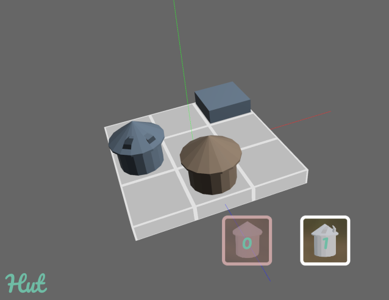
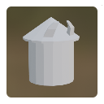

# 🏙 LibraCity - city planning on a needle!

_Tentative entry for LDJam #49 - Theme: unstable._

LibraCity is a city planning game on a needle. Literally. In this puzzle game, the entire city rests on a base plate at equilibrium over a needle. Adding buildings destabilizes the entire city. Complete each level by laying out the required buildings while keeping the stability of the entire city.

Made in [🦀 Rust](https://www.rust-lang.org/) with [🕊 Bevy Engine](https://bevyengine.org/).

## How to play

The goal is to place all buildings available in the inventory while keeping the base plate of the city at equilibrium over the needle (the center of the plate). Each building has a weight, making it tilt the plate more or less. Buildings further away from the needle also "count" more toward tilt (level effect).

Controls:
- W/A/S/D to move cursor (the dark grey cube)
- Q/E or TAB to change current inventory slot
- SPACE to place a building
- R to reset a level and retry
- ESC to exit game

## Buildings

### Hut

**Weight:** 1.0

The building of choice of ermits and other isolated souls.

### Chieftain Hut

**Weight:** 2.0

A larger, heavier, and more imposing hut marking the superiority of the Chieftain of the village.