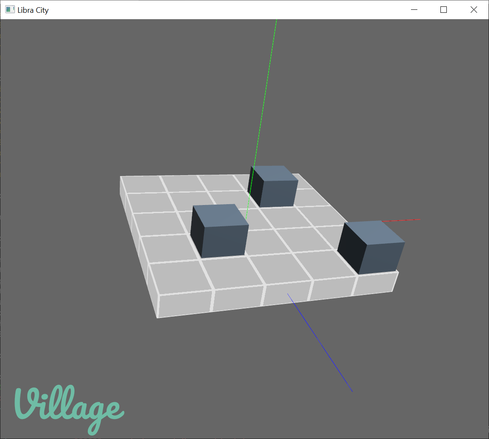

# 🏙 LibraCity - city planning on a needle!

_Tentative entry for LDJam #49 - Theme: unstable._

LibraCity is a city planning game on a needle. Literally. In this puzzle game, the entire city rests on a base plate at equilibrium over a needle. Adding buildings destabilizes the entire city. Complete each level by laying out the required buildings while keeping the stability of the entire city.

Made in [🦀 Rust](https://www.rust-lang.org/) with [🕊 Bevy Engine](https://bevyengine.org/).
